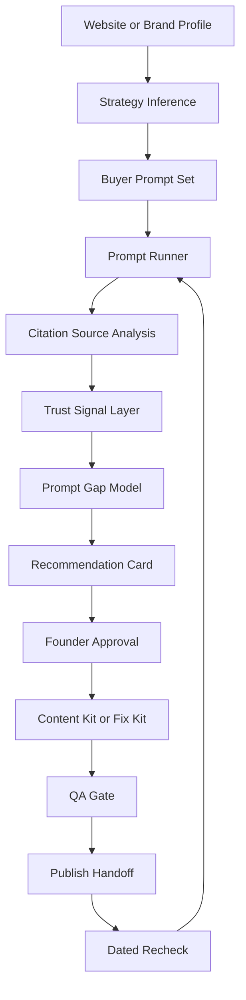
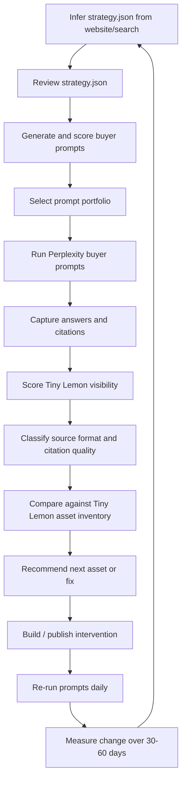
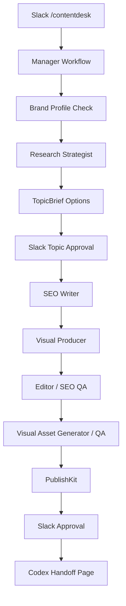
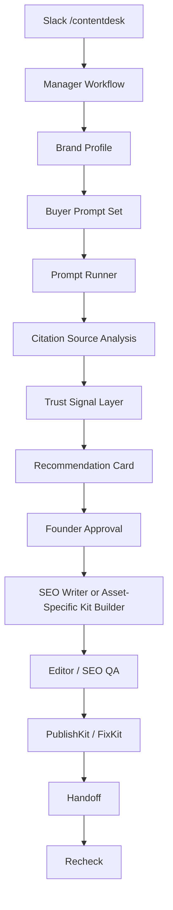
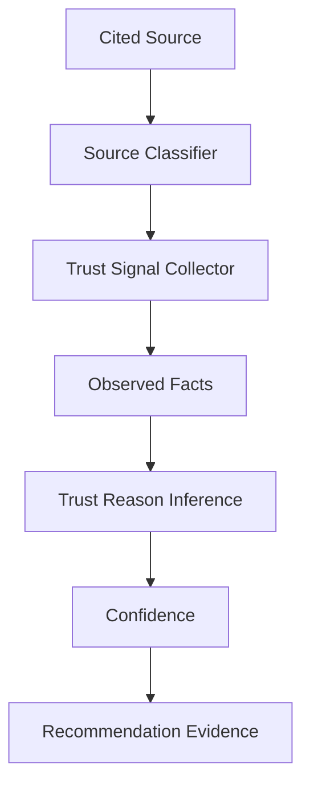

# ContentDesk Architecture

ContentDesk is a Slack-first SEO/AEO operator for lean founders. Its job is not to generate content by default. Its job is to identify which source formats AI/search systems already trust for a buyer prompt, recommend the next most realistic asset or fix, produce the kit, and schedule a recheck.

## Core Question

Every workflow starts from one question:

```text
For this buyer prompt, what kinds of sources are AI/search systems already trusting?
```

This keeps ContentDesk from assuming the answer is always a blog post. Sometimes the right move is an owned guide. Sometimes it is a marketplace listing fix, a comparison page, a docs update, a Reddit reply, or a review-site improvement.

## High-Level Flow



## First Visibility MVP

The first automated visibility experiment is deliberately narrow:

```text
Brand: Tiny Lemon
Provider: Perplexity
Goal: make Tiny Lemon more mentioned/cited in AI buyer answers
Experiment window: 30-60 days
Recheck cadence: 1 day for now
Command: npm run visibility:scan
Strategy input: data/tiny-lemon/visibility/strategy.json
Website-first draft: npm run prompt:infer -- --url https://tinylemon.xyz
Selected prompt input: data/tiny-lemon/visibility/prompts.selected.json
Output: data/tiny-lemon/visibility/runs/YYYY-MM-DD.json
```

This proves the visibility loop before adding ChatGPT, Gemini, Google AI Overviews, Slack scheduling, or database persistence.

The first product loop is:



Success means:

```text
Tiny Lemon appears in more answers.
Tiny Lemon gets cited directly.
Competitor-only answers become mixed answers.
Owned or earned Tiny Lemon assets enter citations.
Recommendations become more specific over time.
```

## Current Implemented Flow

The current codebase already implements the content-production side:



The next architectural upgrade is to insert a Recommendation Card and Citation Source Analysis before writing begins.

## Target Flow



## Components

### Brand Profile Service

Source of truth for the workspace.

Current fields include:

```text
app name
target merchant
positioning
features / use cases
competitors
preferred voice
visual preferences
forbidden claims
CTA style
existing blog/docs URLs
```

Future fields should include:

```text
proof points
conversion goal
claims we can make
claims we cannot make
important marketplace/review/community URLs
competitor confidence
```

### Buyer Prompt Set

The set of buyer questions ContentDesk will test.

For product use, strategy inference can start from a website URL when a full Brand Profile
does not exist yet:

```text
website URL
-> site profile
-> optional Parallel search for market/competitor context
-> strategy.json draft
-> human review
-> buyer prompt candidates
-> selected prompt portfolio
```

The inferred strategy includes audience, category, positioning, primary use cases, buyer jobs,
competitors, and asset inventory. `strategy.json` is draft until reviewed. Selection should run
after review so weak competitor inference cannot poison the visibility baseline.

Examples:

```text
best AI model photo apps for Shopify
Botika alternatives for Shopify
how to create model photos without a photoshoot
which Shopify app creates on-model product photos
```

Prompts should map to buyer journey stages:

```text
awareness
consideration
evaluation
decision
```

The Tiny Lemon MVP uses these prompt groups:

```text
category_search
competitor_comparison
problem_aware
solution_aware
integration_use_case
high_intent_purchase
```

### Prompt Runner

Runs buyer prompts across search/AI surfaces and captures observed answers and citations.

First surface:

```text
Perplexity
```

Roadmap surfaces:

```text
ChatGPT
Google / AI Overviews
organic search results
Reddit / community search
```

The Prompt Runner should output observations, not recommendations.

### Citation Source Analysis

Classifies what source formats are currently winning for each buyer prompt.

Source formats:

```text
marketplace_listing
reddit_thread
comparison_page
vendor_docs
review_site
youtube_video
listicle
product_page
blog_guide
official_docs
unknown
```

`unknown` is an internal safety label. It means the system could not confidently classify the source format yet. User-facing output should either classify it after inspection or say that manual classification is needed.

Citation quality is tracked separately from source format:

```text
owned_source
earned_source
platform_marketplace
community
affiliate_seo
review_site
unknown
```

Example:

```text
apps.shopify.com listing
source format: marketplace_listing
citation quality: platform_marketplace
```

### Trust Signal Layer

Collects observable facts before making trust inferences.

This is the truth layer. ContentDesk should separate observed facts from interpretation.



MVP trust signals:

```text
source URL and domain
source format
title / H1
visible date or metadata date
official marketplace yes/no
review count and rating when available
prompt-term match in title/headings/body
excerpt that answers the prompt
confidence
```

Roadmap trust signals:

```text
Ahrefs authority metrics
sitemap lastmod
schema / structured data detection
review velocity
Reddit comments/upvotes/sentiment
cross-engine citation frequency
AI visibility history
```

Example evidence model:

```text
Observed facts:
- Source is apps.shopify.com
- Source format is marketplace_listing
- Rating is 4.8
- Review count is 412
- Prompt terms appear in category and description

Inference:
AI/search may trust this because it is an official marketplace listing with structured product metadata and review proof.

Confidence:
High
```

### Prompt Gap Model

Compares the trusted source landscape against the brand.

It answers:

```text
Is the brand mentioned?
Does the brand have an asset in the winning source format?
Which competitors or third-party sources appear?
What trust signals are competitors showing?
Can the brand realistically compete on this surface?
What is the best next move?
```

The Tiny Lemon MVP compares cited source patterns against a lightweight asset inventory:

```text
Shopify App Store listing
homepage
comparison pages
alternative pages
blog guides
docs/help pages
Reddit/community mentions
YouTube/videos
review profiles
case studies
```

### Recommendation Card

The decision artifact. It turns research into an operator recommendation.

It must answer:

```text
What did we find?
Why does it matter?
What evidence supports it?
What should we publish or fix?
Why this asset over others?
How should it be structured?
What should we recheck later?
```

The Recommendation Card should include:

```text
buyer prompt
trusted source formats
currently cited/surfaced sources
observed trust signals
inferred trust reason
brand gap
recommended asset or fix
why this move over others
recheck date
recheck prompts
```

### Content Kit / Fix Kit Builder

Creates the output based on the recommended source format.

Examples:

```text
marketplace_listing -> App Store listing improvement kit
reddit_thread -> founder reply / community answer kit
comparison_page -> comparison page content kit
vendor_docs -> docs or FAQ update kit
review_site -> review-site positioning / review request kit
blog_guide -> article kit
technical_issue -> implementation handoff
```

### QA Gate

Checks both the recommendation and the produced kit before the user sees it.

QA should verify:

```text
The recommendation matches the buyer prompt.
The recommended asset matches the winning source format.
Observed facts are separated from inference.
Claims are supported or removed.
Competitors/sources are real.
The asset is publishable or actionable.
The recheck plan has a date and prompts.
```

### Publish Handoff

Packages the final approved kit for manual execution.

Current implementation:

```text
PublishKit
Codex handoff prompt
/handoff/[artifactId] page
```

Future handoffs may include:

```text
App Store listing update
Reddit reply
comparison page
docs update
technical SEO fix
review-site action plan
```

### Recheck Scheduler

Every Recommendation Card should include a dated recheck plan:

```text
recheckOn
prompts to rerun
expected signal
what to do if nothing changes
```

This keeps the recommendation falsifiable instead of theatrical.

## Data Principle

ContentDesk should never collapse facts and guesses into one sentence.

Use this separation:

```text
Observed:
What we directly saw or measured.

Inferred:
Why that source may be trusted.

Confidence:
How strongly we believe the inference.

Next action:
What to publish, fix, or recheck.
```

## Implementation Boundary

Current safe slice:

```text
RecommendationCard schema
Recommendation builder from TopicBrief
Recommendation builder from Reddit teardown
Reddit teardown renderer
```

Next safe slices:

```text
Add Citation Source Analysis schema.
Add Trust Signal schema.
Convert one Tiny Lemon prompt scan into structured trust signals.
Add RecommendationCard fields for trusted source formats and trust signals.
Only then insert RecommendationCard into the main content-cycle workflow.
```
